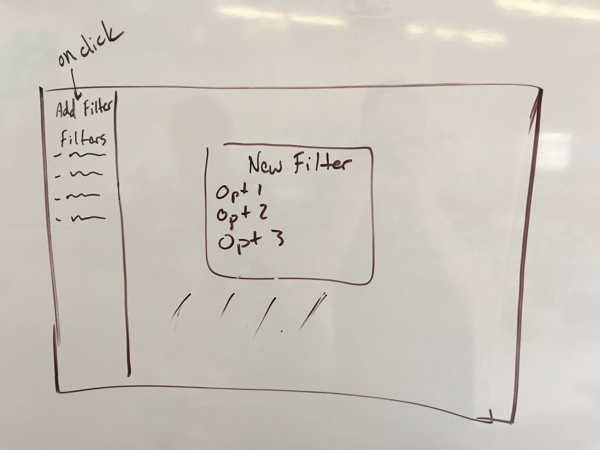
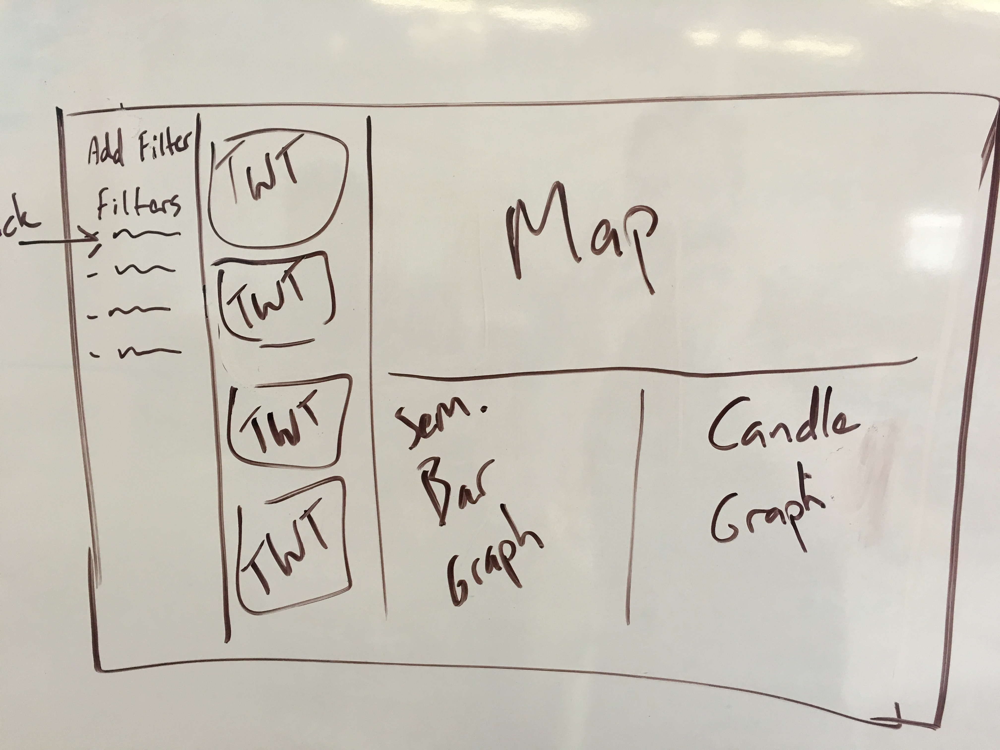

# Fitter - React Client for a Twitter Filter API
Created by [Kyle Maxwell](https://github.com/KyleJayMaxwell), [Ben Hernandez](https://github.com/benaychh) and [David Sudia](https://github.com/dsudia).
## Uses and Users
Fitter is a client that accesses an eponymous API that filters Tweets. The API can be found [here](http://github.com/dsudia/fitter). Users login to Fitter and can select a number of filters to apply to incoming Tweets, and then view those tweets. Anyone who wants to customize a Twitter feed to analyze different data can use Fitter.

## Technologies Involved
Fitter uses React.js for updating users' view of new tweets and associated data.

## Features
Users can choose to filter tweets by geolocation, semantic analysis, and/or keyword searches (of bodies and hash tags). They can save these filters, so when they login they can create a new filter or choose one they have made previously. Tweets are presented in a standard feed format, as well as in a bar graph if semantic analysis is chosen, a candle graph, and a map of origin locations.

## Project Tracking
[Pivotal Tracker](https://www.pivotaltracker.com/n/projects/1572541)

## Mockups
#### Initial view on login

#### View with filter active

